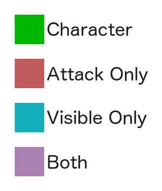
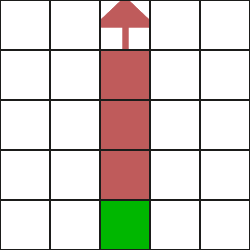
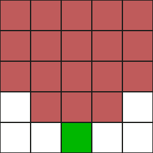
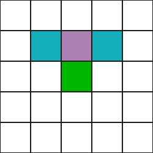
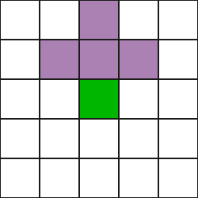
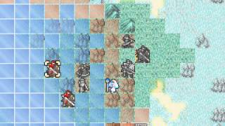
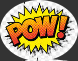

#Ghess
V 1.0

4/3/2016

##Game Concept
Ghess is a competitive multiplayer game where players use the tools they have in a simple system to predict what the other person is going to do. The game is meant to eliminate all technical skill necessary from a user. They must instead use only their powers of reasoning to predict and deduce what the other player is going to do.


##Characters
Each character in the game *must* represent something unique. There also must exist every character which represents a unique way to play to bring true diversity into the game.

Diagram Key:



 
####Archer


Pros: Can fire an arrow, which will go straight across the map.

Cons: Is completely blind.
####Javelin thrower

Pros: Can throw a javelin at any point in a diagonal or straight direction.

Con: Is completely blind.
####Swordsman


Pros: Can attack forward and has a shield.

Cons: Isn't particularly good at anything. 
####Pikeman


Pros: Can see and attack two squares ahead and diagonally forward.

Cons: Doesn't have a shield.
####Scout
Pros: Can see very far.

Cons: Can't attack.
####Wizard
Pros: Can fire a powerful beam of energy pretty far onto the board, eliminating everyone in its path.

Cons: Light from staff can always be seen. Must recharge one turn after firing.
####Assassin
Pros: Can move very quickly.

Cons: Can't see particularly far, is vulnerable to everything.
####Fire Thrower
Pros: Can light up squares in a certain area within x of self. 

Cons: Before one is thrown, one turn must be spent lighting it.
####Necromancer
Pros: Can raise the dead.

Cons: Cannot attack, must recharge.
####Electrophile
Pros: Can call a lightning strike anywhere* on the map.

Cons: Cannot guarantee it hits where he wants. Strike has chance to hit any of the adjacent squares.

####Trapper
Some sort of character who can set up traps.

####Flyer
Pros: Can fly over the obstacles.

Cons: Weak otherwise.

####Bomber
Pros: Can throw bombs.

Cons: When he is killed by projectile, he explodes.


##Objects/Powerups

####Shield
Block menial attacks (arrows, javelins) from the front, makes a noise to tell the person where shield holder is.
####Torch
Lights up spaces around torch, can be thrown.
####Arrow
Flies straight until it hits something/someone. Cannot penetrate shields.
####Javelin
Lobbed, can hit any sqare within some range of squares. Hits precisely, but only hits one.
####Staff
Shoots a beam straight 4 squares in front of it, killing everything in its path. It must recharge.
####Lightning Strike
Can strike any location on map, but doesn't definitely strike the spot selected. It strikes at random within a square grid area.

##Arenas
Arenas should be varied. We must have the option to have flexible map sizes, but also to have objects - walls or impassable terrain. Asymmetric balance is the key. Information about the map is not hidden - tiling will be grayed out to show which ones are not visible. Something like the following, but likely with darkness instead of light:




##High Level Gameplay 
The game is about forming assumptions based upon what the player knows about the game and the person they are up against, working on those assumptions, and then adjusting when new information is gained. Every action the player commits should be to do one of two things: either collect information or to act upon assumptions.

Games are generally defined as best 2 out of 3, so the users get to see what their adversary's strategies are and adapt.

####Pregame
Players are given the map information they're playing on and it's likely they know who they're playing against. Here the players will choose their roster and the placement of their troops.

####In game
Players start with almost no information. The HUD will reflect the knowledge the players have. Circles represent the number of players alive for each team. At the start, players cannot see what the other person has selected. As the enemy characters are revealed, their respective circles change into a symbol representing what they are. If a character is eliminated before they are discovered, their circle is crossed out. Dead bodies stay on the map. If you come across their body, the circle that was crossed out changes into a crossed out symbol. The idea behind this is that if you can figure out which characters the enemy chose, you can figure out the enemy's game plan.

####Post game
You get to review your enemy's roster. 

##Low Level Gameplay


##Art description
Information is gained in several different ways. One way is by the sound of objects hitting other objects. This leads me to the idea of using onomatopoeias. For example, an arrow hitting a shield in the dark would make something like the following show up out of the darkness:



The result is a comic book art style. I think this is the best direction to go as it would allow us to give each character real personality as well as distinguishing features on the game board (without being as limited by the pixels).

##Sound


##UI/Controls


##Networking
###Server to client message


####Board state:
Whose turn it is.

Controller object:

*  Team
*  Type
*  Visibility
*  Attack
*  Location

####Animations:
[['arrow', [[3,3],[3,6]],...]

##Client to server message
```
Message name: "update-game" 

Message data:	 {
	id: gameID,
	type: 'pass','attack','turn','move',
	objectPosition: position of acting object,
	(optl) targetPosition: 'move' and 'attack',
	(optl) newHeading: 'turn'
}
```


